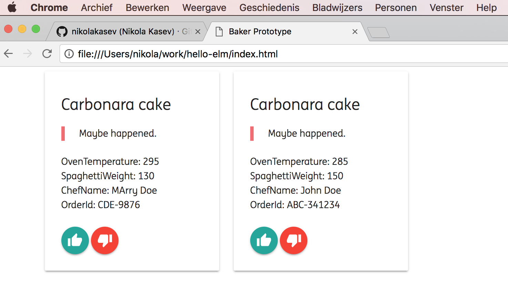

Installed the following two extra packages:

*elm-package install elm-lang/http*

*elm-package install NoRedInk/elm-decode-pipeline*

Turn into JavaScript first:

*elm-make Main.elm --output=main.js*

Then open index.html.

Useful links:
- https://github.com/izdi/elm-cheat-sheet
- https://www.gitbook.com/book/sporto/elm-tutorial/details
- http://klaftertief.github.io/elm-search/

Shortcuts in Atom:

Ctrl+M jump matching bracket

Ctrl+Cmd+M select text inside brackets

Ctrl+Cmd+Up/Down move line up and down

Cmd+T go to file

Cmd+R go to symbol

Cmd+W close window

Cmd+F search in window
Cmd+Shift+F search in the entire project

Ctrl+G go to line

Cmd+0 reset font size, Cmd-= increase, Cmd-- decrease

Cmd-\ close tree-view

Install sass on the Mac:

**sudo gem install sass**

To watch the Materialize sass folder and output as a CSS to the css folder:

**sass --watch sass/:css/**

Atom packages:

elm-format

atom-beautify

Installed Facebook's watchman:

**brew install watchman**

Then watching and making:

**watchman -- trigger . buildme '*.elm' -- elm-make --output=main.js**

Using Express from https://expressjs.com/ for the mock API, run:

**npm install express**
**npm install body-parser**
**npm install cors**
**npm install sleep**
**npm install morgan**
**node mock-api.js**

The end result is this:

